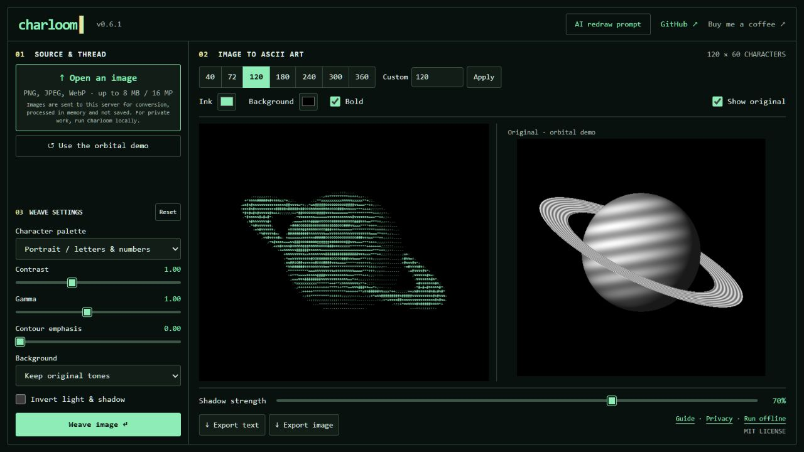
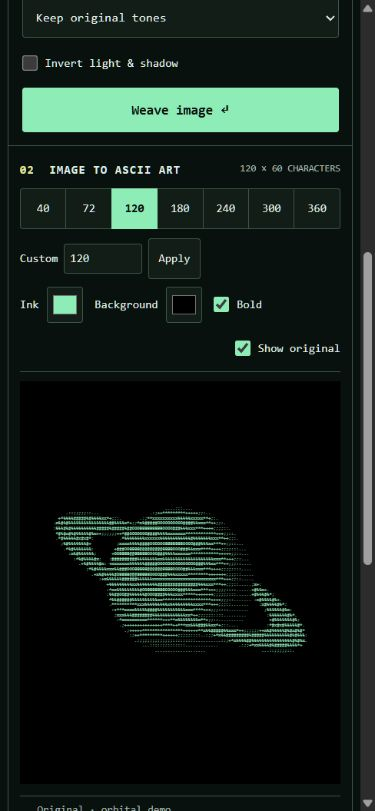
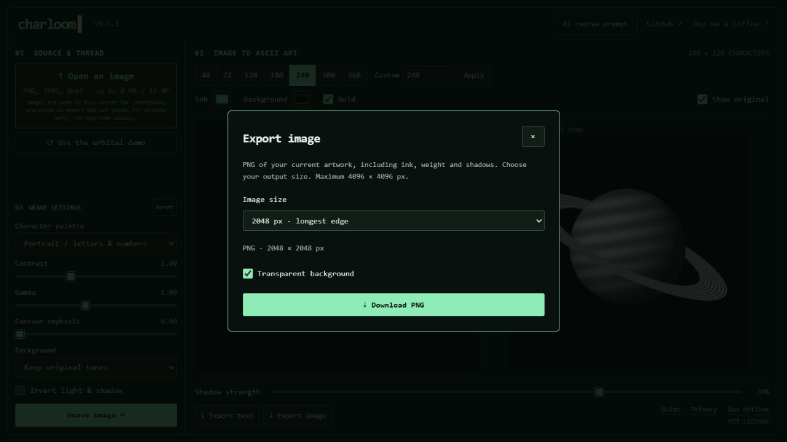

<div align="center">

# Charloom

**Pixels in. Characters out.**

Weave images into expressive text art — crisp contours, responsive sizes, and a little terminal magic.

<a href="https://buymeacoffee.com/alexpapay"></a>

[](https://github.com/alexpapay/charloom/actions/workflows/check.yml)
[](https://www.python.org/)
[](LICENSE)
[](https://charloom.popovich.one)

[Try the playground](https://charloom.popovich.one) · [CLI reference](docs/cli.md) · [Prepare better inputs](docs/redraw.md) · [Self-host](docs/deployment.md)

```text
         . : + * x % # 0 8 @
        pixels → characters
           one ink color
            many shades
```

</div>

Charloom is an **offline Python image-to-text engine** with an optional web playground. Use ordinary ASCII in a terminal, or bring the same characters to the web with per-cell opacity. Your final artwork is selectable text — no canvas, SVG, raster overlay, or image font.

## See it in action



| Mobile workspace | PNG export |
| :---: | :---: |
|  |  |

## What makes it useful

- **Independent resolutions.** Each size is sampled from the original, not a smaller text preview.
- **Shape stays shape.** EXIF orientation, aspect-aware grids, contain/cover framing, and measured browser line heights.
- **Light beyond the glyph.** Optional opacity data preserves tones between character steps. Change one CSS color to recolor the artwork.
- **Tune the weave.** Custom palettes, brightness, contrast, gamma, contours, detail enhancement, and background masks.
- **Take it with you.** UTF-8 TXT + reproducibility metadata from the CLI; TXT, self-contained HTML, and JSON from the playground.
- **No AI required.** The converter is deterministic and works offline. An optional redraw prompt helps prepare difficult portraits.

## Quick start

Requires Python 3.12+ and [uv](https://docs.astral.sh/uv/getting-started/installation/).

```sh
git clone https://github.com/alexpapay/charloom.git
cd charloom
uv sync --locked
uv run charloom photo.jpg --preset portrait --output output/portrait
uv run charloom photo.jpg --width 72 --preview
uv run charloom photo.jpg --widths 40,72,120 --tones --output output/portrait
```

`ascii-gen` remains an alias for compatibility. On Windows, quote paths containing spaces. If uv was installed with pip and is not on PATH, use `python -m uv` instead of `uv`.

Or install directly from this repository:

```sh
uv tool install git+https://github.com/alexpapay/charloom.git
charloom photo.jpg --preset portrait --preview
```

The package has not been published to PyPI. The Git URL is the installation source.

## Run your own playground

```sh
uv sync --locked --extra web
uv run charloom-web
```

Open **http://127.0.0.1:4175**. Upload a PNG, JPEG or WebP and tune the conversion. Choose one of seven resolutions or enter 2–400 columns; new sizes are generated on demand and cached sizes switch instantly. Ink, weight and shadows update live. The orbital demo opens with its source visible. Toggle **Show original** for a local source comparison beside the text on desktop, or below it on mobile. The desktop workspace fits the browser height and the artwork scales without distortion. The orbital sample is generated mathematically; no personal photos or third-party demo assets are shipped.

The hosted playground **sends the selected image to its server**. Uploads are processed in memory and are not saved by the application. Requests are limited to 8 MiB, 16 megapixels and bounded output grids. Run locally or use the CLI for private/offline work. Hosting infrastructure may retain ordinary request logs; image bodies are not logged by Charloom.

## From generator to website

```sh
uv run charloom illustration.png --preset illustration --output ../my-site/assets/ascii/illustration
```

An output set contains `.txt` variants and a `.meta.json` manifest. `--tones` adds a `.tones.json` file for each size, referenced as `tonesFile` in the manifest. Normal TXT output stays compatible with existing consumers.

Render text using `<pre>` with a monospaced font. **Match the cell geometry:** `lineHeight = measuredCharacterWidth / character_aspect`. At an aspect of 0.5, the line height must equal twice the character width. The playground's HTML export handles this and includes all tones, with no scripts or external dependencies.

See [the output format and HTTP contract](docs/formats.md). Opacity is an artistic tone curve, not a calibrated model of glyph coverage. Very low column counts inevitably lose small facial details.

## Development

```sh
uv sync --locked --extra web
uv run pytest
uv run ruff check .
uv run ruff format --check .
uv build
node --test tests/*.test.js
```

The interface uses plain JavaScript and CSS, with no frontend build step or npm dependencies. Tests cover conversion, masks, framing, CLI outputs, tones, HTTP limits and HTML export. CI runs on Windows and Linux.

```text
ascii_gen/             Python engine, CLI and optional web server
ascii_gen/static/      Playground interface and text renderer
ascii_gen/presets/     Packaged presets
presets/               Additional reproducible recipes
tests/                 Python and browser-logic tests
docs/                  CLI, formats, redraw prompt and hosting guide
deploy/                Reverse-proxy example
```

## Contributing

Bug reports, character palettes and examples are welcome. Read [CONTRIBUTING.md](CONTRIBUTING.md). For vulnerabilities, see [SECURITY.md](SECURITY.md).

## Roots & license

Charloom grew out of the text-only website [popovich.one](https://github.com/alexpapay/popovich.one). It now lives independently; the website only consumes generated text.

MIT © 2026 alexpapay. Built with [Pillow](https://pillow.readthedocs.io/), [NumPy](https://numpy.org/), and optionally [FastAPI](https://fastapi.tiangolo.com/) / [Uvicorn](https://www.uvicorn.org/). Dependencies retain their own licenses.

## What's new in 0.3.0

- A compact desktop workspace with proportional artwork fitting and a separate settings section.
- Side-by-side source comparison on desktop, stacked on mobile; the orbital demo includes its exact source image.
- Seven preset widths and custom widths from 2 to 400 columns, generated on demand.
- Smooth shadow adjustments without rebuilding the character grid.
- An optional AI redraw prompt with one-click copying.
- Improved upload concurrency limits and playground layout polish.

## Search visibility and analytics

Version 0.3.1 adds an indexable `/guide`, `/privacy`, `/robots.txt` and `/sitemap.xml`, descriptive metadata and WebApplication microdata. Submit the sitemap in Google Search Console for the verified `charloom.popovich.one` property and inspect the homepage and guide. Indexing and rankings are controlled by search engines.

Hosted Google Analytics uses `G-YLDL8WREEW` only on `charloom.popovich.one`, after explicit opt-in. Declining makes no Google tag requests; local installations do not load it. The Privacy page resets the saved choice. Image data, filenames and generated text are not sent as analytics events. Configure enhanced measurement in GA4 to disable form interactions if enabled; conversion form contents are not intended for analytics. Verify incoming page views in GA4 Realtime after allowing analytics. Public page delivery alone cannot confirm ingestion by the property.

## Export updates in 0.4.0

Use **Export text** for TXT, HTML + tones, generated JSON or clipboard copy. **Export image** downloads a PNG with a transparent or selected background at a selected size (1024, 2048 or 4096 pixels on the longest edge, or a custom longest edge). Both ink and background apply only to the artwork. PNG generation runs locally in the browser. See [CHANGELOG.md](CHANGELOG.md) for version history.

## Live tonal preview

Changing contrast, gamma, contours, inversion or background removal shows a processed preview after a short pause. Original / Processed compares it with the source. ASCII updates with Weave image. The preview uses shared tone processing at up to 512 pixels; contour detail can differ from the lower-resolution character grid. Uploads are sent again for each preview update and remain subject to the same upload and concurrency limits. The optional `preview=true` query parameter on `/api/convert` and `/api/demo` returns PNG; omitted or false keeps the existing JSON response.

## Support Charloom

Enjoying Charloom? [Buy me a coffee](https://buymeacoffee.com/alexpapay) and help keep the characters flowing.
